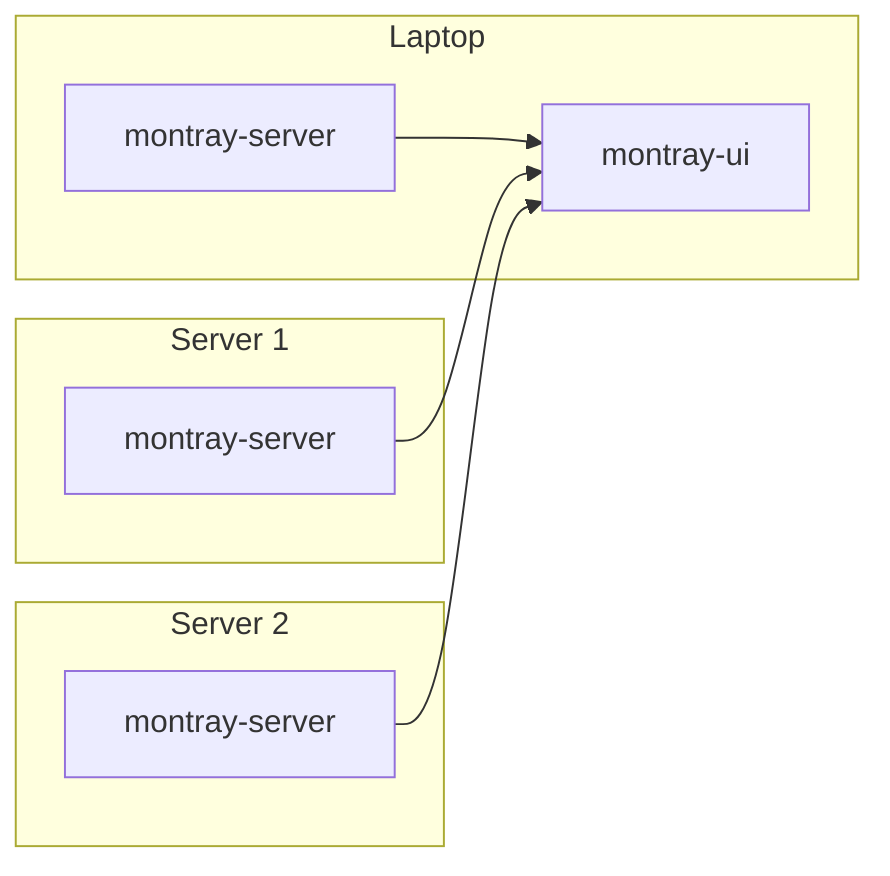

# Mr. Montray is watching your services

Montray is a lightweight tray-icon monitoring utility for systemd services and
anything else you can check from the command line, on both local and remote
machines.


## Project history

Problem: Linux doesn't tell me loudly enough when a systemd service breaks.
Back in 2021 my Syncthing service had been broken for weeks, and I only figured
that out later, after noticing that my files got badly out of sync, and it
wasn't fun to reconcile. Systemd knew it was broken, yet it didn't tell me.
That's not good enough.

I also had a Certbot service silently stop working and fail to refresh
certificates, and other similar cases.

And I didn't want some enterprisey monitoring for this simple task: I just
wanted a simple icon, always present in the system tray: green means it's all
good, blinking yellow/red means something's broken. That's it.

Soon after, I wanted to reuse the same icon not only for systemd services, but
also for arbitrary command-line checks, e.g. to check that there's enough disk
space, or that a RAID is healthy, or anything else really.

So, meet Montray: a lightweight system-tray app that watches your services,
runs command-line checks, and lets you know when something goes wrong.

## Overview

This project has two main parts:

  * `montray-server`, a background service written in Go: runs on a machine, checks its
    health, and serves the current incidents via simple read-only WebSocket
    API;
  * `montray-ui`, a desktop app written in Rust + Slint: connects to one or
    more `montray-server`s, receives data from them, shows a tray icon, sends desktop
    notifications, and provides a native GUI.

So `montray-server` is a server (which can run locally too), and `montray-ui` is a
client which runs on e.g. a laptop. If we have a laptop and two servers, a
typical setup looks like this:



Montray Server reports incidents, each of them has:

- A key, like `systemd.my-service` or `free-space.exec-result`
- A state: `warning` or `error`

These incidents are generated according to the Montray Server configuration. For
details, see [Configuring Montray Server](./docs/montray_server_config.md).

Montray UI combines these incidents. For each incident, it also prefixes the
keys with the ID for that particular server, such as `my-server` (which you
specify in the Montray UI config), so the key becomes
`my-server.systemd.myservice`.

For details, see [Configuring Montray UI](./docs/montray_ui_config.md).

If an incident happens and we want to just acknowledge it but worry about it
later, we can snooze it in the UI, so the icon stops being annoying but it'll
get unsnoozed again later.

The tray icon shows the worst current non-snoozed state:

  * Gray: the initial state isn't known yet;
  * Green: everything is OK;
  * Magenta blinking: Montray UI itself has an internal connection or tunnel error;
  * Yellow blinking: at least one warning;
  * Red blinking: at least one error.

## Installation Quick Start (Linux)

### Monitoring local machine

The easiest way to install both `montray-server` and `montray-ui` to monitor local
machine health is as follows:

First, download the [latest prebuilt binaries from GitHub](https://github.com/dimonomid/montray/releases/latest),
like `montray-server-x.y.z_linux_amd64.tar.gz` and
`montray-ui-x.y.z_linux_amd64.tar.gz`, and unpack them. You'll get two binaries:
`montray-server` and `montray-ui`.

Then:

```bash
# Set up the monitoring service and start it. This also installs montray-server
# under /usr/local/bin when not already there.
sudo ./montray-server setup

# Install the desktop application system-wide:
sudo install -m 755 montray-ui /usr/local/bin/montray-ui

# Let the desktop application create its default config, autostart entry,
# and application launcher:
montray-ui setup

# Start the desktop application (Montray Server is already running):
montray-ui
```

You should now see a tray icon, and if you click on it, you'll see the UI. When
you reboot, it will start automatically.

### Monitoring remote machines

If you have e.g. a personal server which you also want to monitor using the
same interface on your desktop, then on each such remote machine follow the
same steps as above, but only for `montray-server` (no need to install `montray-ui`
on the servers).

Having `montray-server` running on your server, we need to point our local
Montray UI (`montray-ui`) to it. By default, Montray Server only listens on
127.0.0.1, so we can't reach it directly from a laptop.

Presumably you have ssh access to your server with public key authentication
(i.e. you can ssh there without a password), so the easiest way forward here is
to establish an ssh tunnel, and Montray UI has convenient support for it:
open the config file `~/.config/montray-ui/montray-ui.yml`, and add one
more entry to the `wsClient.servers` array, like that (adjusting at least your
server hostname and username). There is no `addr` in this entry: for a
structured SSH tunnel, Montray UI automatically allocates an available port
on `127.0.0.1`. You may still set an explicit loopback `addr` with a port of
your choice when a fixed local forwarding port is useful.

```yaml
    - id: myserver # Arbitrary but unique ID for this server.
      tunnel:
        ssh:
          host: myserver.com  # TODO: your actual server hostname
          user: myuser        # TODO: your actual ssh user
          port: 22            # Change if using non-default ssh port
          remoteServerAddr: 127.0.0.1:41990 # Montray Server listening port
```

And restart Montray UI (`montray-ui`) by right-clicking the tray icon and
selecting "Restart and reload configuration." Open the UI and verify that the
list of servers now includes your newly added remote server as well.

SSH tunnel is not the only way to access remote servers; Montray UI also supports
TLS and bearer token authentication. For details, see docs on
[Security](./docs/security.md).

## Configuration

The default config (which `sudo montray-server setup` writes to
`/etc/montray-server.yml`) is
as follows: if any systemd service is failing, it's a warning (the tray icon
will be blinking yellow). If there's less than 100 MiB of free space in the
root partition, it's an error (the tray icon will be blinking red). Otherwise,
it's all good (the tray icon is green).

The config includes comments and examples, so take a look and experiment with
it; and also check the [Configuring Montray Server](./docs/montray_server_config.md)
docs. For
instance, I like to explicitly list services I particularly care about, such as
Syncthing, and configure any state other than `active` as an error rather than
a warning. That includes services stopped manually - if it was manually stopped
for some reason, I want to be annoyed by the blinking icon until the service is
running again. And I have some more custom exec checks as well.

Don't forget to restart the Montray Server systemd service to apply the changes:

```sh
sudo systemctl restart montray-server.service
```

## Non-Linux OS support

So far Montray was only tested on Linux. Nevertheless, the client
(`montray-ui`) should work on Windows and MacOS as well, so you can run it
there and monitor your remote Linux servers, but not so much the local machine.

Even `montray-server` can technically run on non-Linux, but obviously `systemd` is
irrelevant there, and then the only useful check there is `exec`: just polling
some script periodically, so we lose the out-of-the-box system-wide system
service monitoring, and thus the usefulness is limited.  Would be cool to
implement systemd-like checks for Windows and MacOS, but I don't use these so
hard to test. PRs are welcome.

## Development

### Building

You need [Go](https://go.dev/) 1.26 and
[Rust](https://www.rust-lang.org/tools/install) 1.92 or newer.

On Ubuntu, install the native dependencies used to build and run
`montray-ui`:

```sh
sudo apt-get install -y gcc libfontconfig-dev libxkbcommon-x11-0
```

`gcc` compiles native Rust dependencies, `libfontconfig-dev` provides the
Fontconfig development files required by Slint's font stack, and
`libxkbcommon-x11-0` is loaded by Slint/winit when the application runs under
X11.

Having that, to build both `montray-server` and `montray-ui`:

```sh
make
```

To build only one of them:

```sh
make montray-server
make montray-ui
```

To build a debug binary for Montray UI (for a faster build, comparing to release):

```sh
make montray-ui-debug
```

To install built binaries under `/usr/local/bin`:

```sh
sudo make install-montray-server
sudo make install-montray-ui
```

The legacy Go client (serving local web ui) is not part of the default build.
Building it with `make montray-ui-legacy` additionally requires
`libgtk-3-dev` and `libayatana-appindicator3-dev` on Ubuntu.

### Running tests

The test suite uses the same Go and Rust build requirements described above.
It also requires a current [Node.js](https://nodejs.org/) LTS release for the
legacy client's JavaScript tests. Because `go test ./...` compiles the legacy
GTK client, its native dependencies are required on Ubuntu too:

```sh
sudo apt-get install -y libgtk-3-dev libayatana-appindicator3-dev
```

Then:

```sh
make test
```

To run only the `montray-ui` Rust tests:

```sh
cargo test --manifest-path cmd/montray-ui/Cargo.toml
```

Two native window-geometry tests are ignored by the regular suite because
they require a real X11 session and window manager. A headless environment
cannot accurately test window positioning, maximizing, hiding, and restoring.
Run them explicitly, as separate commands:

```sh
cargo test --manifest-path cmd/montray-ui/Cargo.toml native_startup_restores_geometry_and_maximized_state -- --ignored
cargo test --manifest-path cmd/montray-ui/Cargo.toml native_hide_show_preserves_normal_geometry_while_maximized -- --ignored
```

They must run separately because Slint's GUI platform can be initialized only
once per test process. Running both together would make the second test fail
for a platform-initialization reason rather than a geometry problem.

## Screenshots


## Documentation

- [Configuring Montray Server](./docs/montray_server_config.md)
- [Configuring Montray UI](./docs/montray_ui_config.md)
- [Security](./docs/security.md)
